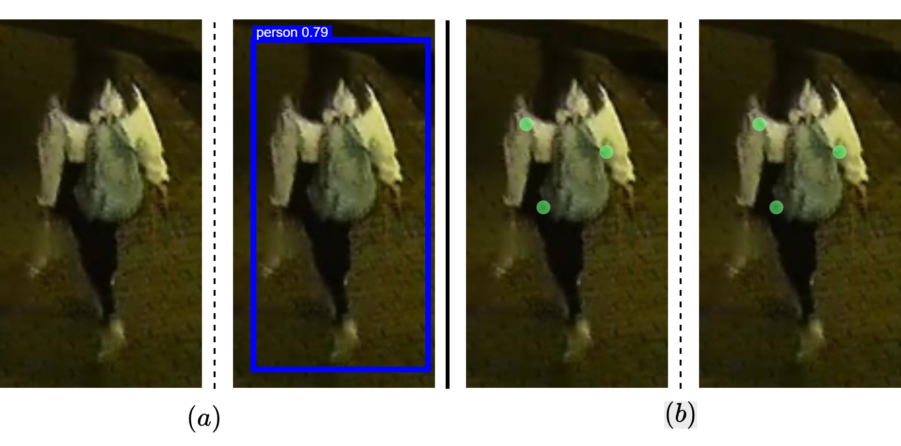
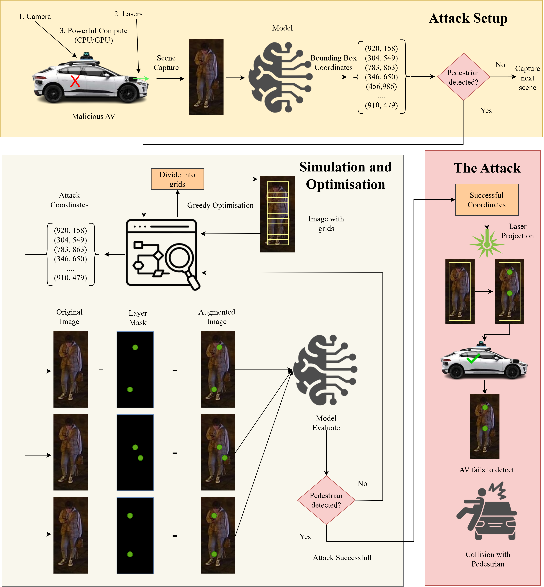
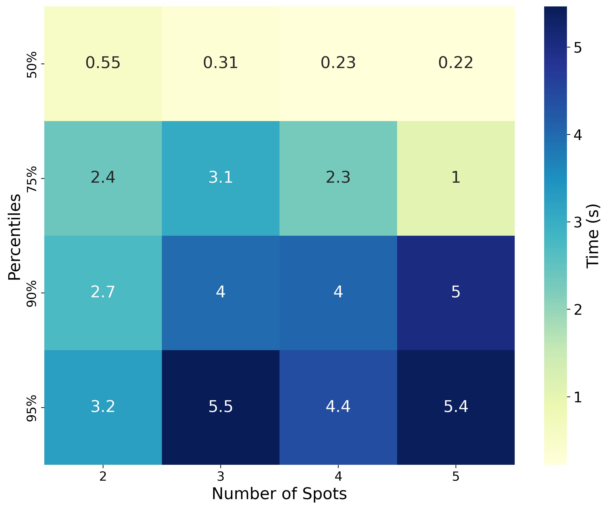
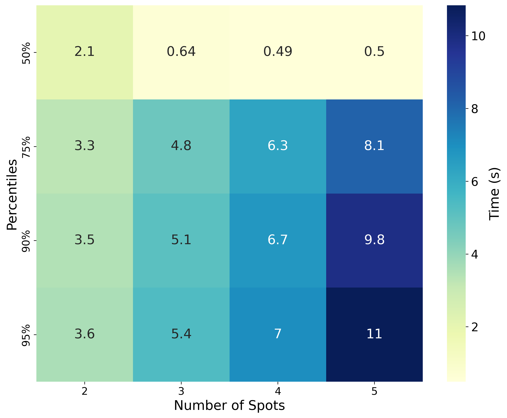
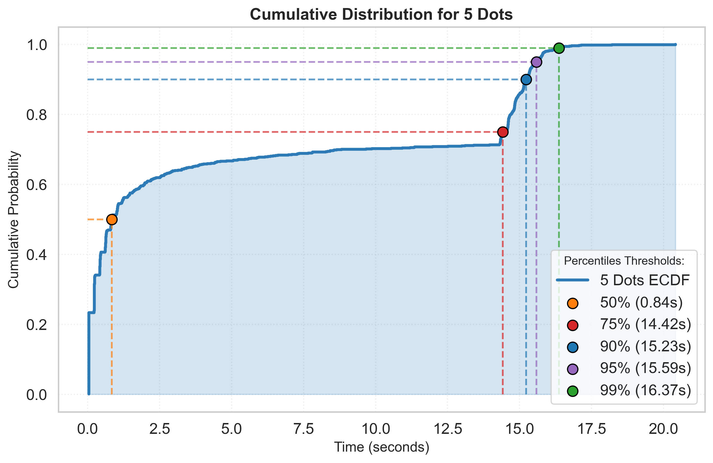
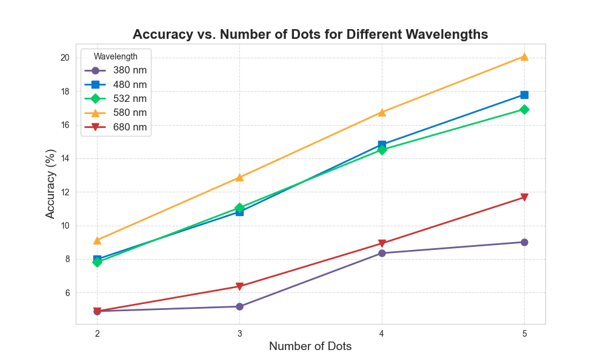

# Disrupting Pedestrian Detection in Autonomous Vehicles: Laser-Induced Adversarial Attacks

## 📌 Overview

This repository contains the code, implementation details, and experimental results for the research paper:

The work introduces a **novel real-time physical-world adversarial attack** using **localized laser spots** projected onto pedestrians to disrupt **YOLOv8-based** detection systems at night.  
Unlike static patch-based methods, our laser-spot approach is:
- **Spontaneous:** Can target arbitrary pedestrians without prior preparation.
- **Discrete:** Small, localized spots make detection harder.
- **Feasible in real-time:** Achieves up to **82.74% attack success rate (ASR)** within **0.22 seconds** in 50% of cases.

---

## 📜 Table of Contents
1. [Introduction](#introduction)
2. [Motivation](#motivation)
3. [Attack Design](#attack-design)
   - [System Setup](#system-setup)
   - [Laser Spot Modeling](#laser-spot-modeling)
   - [Optimization Algorithms](#optimization-algorithms)
4. [Mathematical Formulation](#mathematical-formulation)
5. [Experimental Setup](#experimental-setup)
6. [Results](#results)
7. [Feasibility Analysis](#feasibility-analysis)
8. [Ablation Studies](#ablation-studies)
9. [How to Run](#how-to-run)
10. [Future Work](#future-work)
11. [Citation](#citation)

---

## 🧠 Introduction

Autonomous Vehicles (AVs) rely heavily on **Deep Neural Networks (DNNs)** for real-time pedestrian detection, lane tracking, and traffic sign recognition.  
However, DNNs are vulnerable to **adversarial attacks** — small, carefully crafted perturbations that can cause misclassification.

Previous **physical attacks**:
- Relied on **patches/stickers** (static and non-adaptive).
- Were not feasible for **spontaneous attacks**.

Our approach:
- Uses **projected laser spots** to perturb the scene *before* it reaches the AV’s sensors.
- Requires no pre-positioned materials.
- Executes in **sub-second time**.



---

## 🎯 Motivation

- **Patch-based methods** are static and require preparation.
- **Light-based methods** with projectors or sweeping lasers lack stealth or speed.
- **Our method**:
  - Dynamically optimizes spot placement.
  - Uses a **greedy search** over a **discretized bounding box**.
  - Achieves real-time viability while maintaining high ASR.

---

## ⚙️ Attack Design

### System Setup
The attacking AV:
1. Captures the scene via onboard camera.
2. Runs a pedestrian detection model (YOLOv8).
3. **Digitally simulates** laser spot placement.
4. Uses a **greedy optimization** algorithm to find optimal positions.
5. **Projects** the calculated pattern in real-time.



---

### Laser Spot Modeling

A **laser spot** is parameterized as:

$$
\theta = (\lambda, \Delta x, \Delta y, r, \alpha)
$$

Where:

- $\lambda$ — Wavelength (nm)  
- $\Delta x, \Delta y$ — Offsets from bounding-box top-left corner  
- $r$ — Radius of the spot  
- $\alpha$ — Intensity


For \( n \) spots:

$$
G_\theta = \{\theta_1, \theta_2, \dots, \theta_n\}
$$

The adversarial image is generated via:

$$
x_l^\theta = x + l_\theta
$$

Where $l_\theta$ is the laser mask, blended using **linear fusion**.


---

### Optimization Algorithms

#### Step 1 — Discretization
- Bounding box divided into cells of side  2r (each holds 1 spot).
- Candidate positions = cell centers.

#### Step 2 — Greedy Search
- Initialize with random positions.
- Iteratively adjust one spot at a time.
- Select position that minimizes pedestrian confidence score.
- Multiple **random restarts** to avoid local minima.

📜 See **Algorithm 1** (Grid Generation) and **Algorithm 2** (Greedy Search) in paper.

---

## 📐 Mathematical Formulation

Given:
- Image $I \in \mathbb{R}^{l \times w \times h}$  
- Model $M$ mapping $I$ → bounding boxes & labels.


Attack objective:
1. **Misclassification:**
   $$
   M(I_{\text{adv}}) \neq M(I)
   $$
2. **Imperceptibility:**
   $$
   \|\delta\|_p \leq \epsilon
   $$

Optimization goal:
$$
\theta^* = \arg\min_{\theta} \; \text{Conf}_{M}(B_p, x_l^\theta)
$$

Where $B_p$ is the target pedestrian bounding box.

---

## 🧪 Experimental Setup

- **Models:** YOLOv8 Nano, Small, Medium
- **Dataset:** LLVIP (Low-Light Visible-Infrared Pairs) — 450 selected images.
- **Hardware:** AMD Ryzen 7, NVIDIA GTX 1650
- **Laser Parameters:**
  - $\lambda = 532\,\text{nm}$  
  - $r = 5$ px  
  - $\alpha = 0.7$
- **Optimization:** 3 restarts, 10 iterations/restart, max 5 moves/spot.

---

## 📊 Results

### Attack Success Rate (ASR)

| Model  | 2 Dots | 3 Dots | 4 Dots | 5 Dots |
|--------|--------|--------|--------|--------|
| Nano   | 59.90% | 69.80% | 77.79% | **82.74%** |
| Small  | 52.43% | 61.47% | **79.38%** | 72.99% |
| Medium | 48.34% | 59.57% | 65.14% | 71.78% |


---

## ⏱ Feasibility Analysis

- **YOLO Nano + 5 Dots:** 50% attacks succeed in **<0.22s**.
- More dots → higher ASR & lower median attack time.
- Larger models → slightly slower attacks due to inference time.

  
  


---

## 🔬 Ablation Studies

1. **Wavelength Sensitivity**
   - Peak ASR at **580 nm**.
   - 532 nm still effective and widely available.

   

2. **Number of Restarts**
   - Higher restarts → higher ASR but more time.
   - Trade-off between **speed** and **effectiveness**.

---

## 💻 How to Run

```bash
# Clone repo
git clone https://github.com/<your-repo>.git
cd <your-repo>

# Install YOLOv8 and dependencies
pip install ultralytics  # Installs YOLOv8 + torch, cv2, numpy, matplotlib

# Install other requirements
pip install -r requirements.txt
